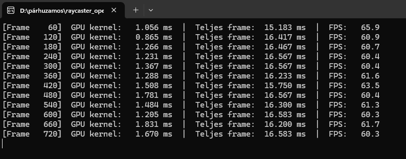
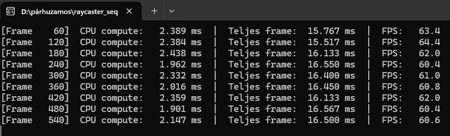

# OpenCL Raycasting Renderer

Ez a projekt egy **raycasting alapú 3D megjelenítő**, ahol a kép kiszámítása OpenCL segítségével párhuzamosan történik.

A programban a CPU kezeli:
- a játékos mozgását,
- a billentyűzet inputot,
- az OpenGL-es megjelenítést.

Az OpenCL kernel számolja:
- a sugarakat,
- a falütközéseket,
- a falmagasságot,
- a textúrázott képoszlopokat,
- a padlót, plafont, eget,
- a framebuffer tartalmát.

---

# OpenCL működés a programban

Az OpenCL rész célja, hogy a raycasting számítás ne sorban, CPU-n történjen, hanem párhuzamosan.  
A programban minden sugár / képoszlop külön OpenCL work itemként fut.

## OpenCL inicializálás

Az `init_opencl()` függvény készíti elő az OpenCL környezetet.

### Platform és eszköz kiválasztása

```c
check_cl(clGetPlatformIDs(1, &g_platform, &platformCount), "clGetPlatformIDs");

err = clGetDeviceIDs(g_platform, CL_DEVICE_TYPE_GPU, 1, &g_device, &deviceCount);
if (err != CL_SUCCESS || deviceCount == 0) {
    err = clGetDeviceIDs(g_platform, CL_DEVICE_TYPE_CPU, 1, &g_device, &deviceCount);
    check_cl(err, "clGetDeviceIDs CPU fallback");
}
```

Először GPU-t próbál választani. Ha nincs elérhető GPU, CPU-ra vált vissza – így a program több gépen is futtatható.

---

## Context és Command Queue

A command queue-t `CL_QUEUE_PROFILING_ENABLE` flaggel hozzuk létre, hogy a kernel futási ideje mérhető legyen:

```c
g_context = clCreateContext(NULL, 1, &g_device, NULL, NULL, &err);

cl_queue_properties props[] = {
    CL_QUEUE_PROPERTIES, CL_QUEUE_PROFILING_ENABLE, 0
};
g_queue = clCreateCommandQueueWithProperties(g_context, g_device, props, &err);
```

A **context** az OpenCL futtatási környezete.  
A **command queue** az a sor, ahová a CPU beteszi a GPU-n végrehajtandó parancsokat (buffer írás, kernel futtatás, visszaolvasás).

---

## Kernel betöltése fájlból

A kernel forrása nem string literálként van a C kódba égetve, hanem futásidőben töltődik be a `raycasting_kernel.cl` fájlból:

```c
static char *load_kernel_source(const char *filename, size_t *out_len)
{
    FILE *fp = fopen(filename, "rb");
    fseek(fp, 0, SEEK_END);
    long len = ftell(fp);
    rewind(fp);
    char *src = (char *)malloc(len + 1);
    fread(src, 1, len, fp);
    fclose(fp);
    src[len] = '\0';
    if (out_len) *out_len = len;
    return src;
}
```

Majd az `init_opencl()`-ban:

```c
char *kernelSrc = load_kernel_source("raycasting_kernel.cl", &srcLen);
g_program = clCreateProgramWithSource(g_context, 1,
                                      (const char **)&kernelSrc,
                                      &srcLen, &err);
free(kernelSrc);
```

Ez azért elegánsabb megoldás, mert a `.cl` fájl újrafordítás nélkül szerkeszthető, és a kernel kód nem duplikálódik a C fájlban.

---

## OpenCL buffer-ek

A CPU és az OpenCL eszköz külön memóriaterületet használ, ezért buffereket kell létrehozni:

```c
g_mapWallBuf    = clCreateBuffer(g_context, CL_MEM_READ_ONLY | CL_MEM_COPY_HOST_PTR,
                                 sizeof(mapWall),    mapWall,      &err);
g_mapFloorBuf   = clCreateBuffer(g_context, CL_MEM_READ_ONLY | CL_MEM_COPY_HOST_PTR,
                                 sizeof(mapFloor),   mapFloor,     &err);
g_mapCeilingBuf = clCreateBuffer(g_context, CL_MEM_READ_ONLY | CL_MEM_COPY_HOST_PTR,
                                 sizeof(mapCeiling), mapCeiling,   &err);
g_textureBuf    = clCreateBuffer(g_context, CL_MEM_READ_ONLY | CL_MEM_COPY_HOST_PTR,
                                 TEXTURE_BYTES, (void*)All_Textures, &err);
g_skyBuf        = clCreateBuffer(g_context, CL_MEM_READ_ONLY | CL_MEM_COPY_HOST_PTR,
                                 SKY_BYTES, (void*)sky, &err);
g_outputBuf     = clCreateBuffer(g_context, CL_MEM_WRITE_ONLY,
                                 sizeof(frameBuffer), NULL, &err);
g_paramsBuf     = clCreateBuffer(g_context, CL_MEM_READ_ONLY,
                                 sizeof(KernelParams), NULL, &err);
```

| Buffer | Szerepe |
|---|---|
| `g_mapWallBuf` | falak adatai |
| `g_mapFloorBuf` | padló térkép |
| `g_mapCeilingBuf` | plafon térkép |
| `g_textureBuf` | fal textúrák |
| `g_skyBuf` | ég textúra |
| `g_outputBuf` | elkészült képkocka |
| `g_paramsBuf` | játékos és kamera paraméterei |

---

# Frame számítás OpenCL-lel

## Kernel futtatása és GPU időmérés

A kernel futtatásakor egy `cl_event`-et adunk át, amelyből a GPU hardver saját belső órájával kinyerhető a pontos futási idő nanoszekundum pontossággal:

```c
cl_event kernelEvent;

clEnqueueNDRangeKernel(g_queue, g_kernel, 1,
                       NULL, &globalSize, NULL,
                       0, NULL, &kernelEvent);
clFinish(g_queue);

cl_ulong t_start = 0, t_end = 0;
clGetEventProfilingInfo(kernelEvent, CL_PROFILING_COMMAND_START,
                        sizeof(t_start), &t_start, NULL);
clGetEventProfilingInfo(kernelEvent, CL_PROFILING_COMMAND_END,
                        sizeof(t_end), &t_end, NULL);
clReleaseEvent(kernelEvent);

double kernel_ms = (double)(t_end - t_start) * 1e-6;  // ns -> ms
```

Ez pontosabb mint bármilyen `clock()` alapú CPU-oldali mérés.

## Kernel argumentumok

```c
clSetKernelArg(g_kernel, 0, sizeof(cl_mem), &g_mapWallBuf);
clSetKernelArg(g_kernel, 1, sizeof(cl_mem), &g_mapFloorBuf);
clSetKernelArg(g_kernel, 2, sizeof(cl_mem), &g_mapCeilingBuf);
clSetKernelArg(g_kernel, 3, sizeof(cl_mem), &g_textureBuf);
clSetKernelArg(g_kernel, 4, sizeof(cl_mem), &g_skyBuf);
clSetKernelArg(g_kernel, 5, sizeof(cl_mem), &g_outputBuf);
clSetKernelArg(g_kernel, 6, sizeof(cl_mem), &g_paramsBuf);
```

## Kernel indítása

```c
size_t globalSize = RAY_COUNT;

clEnqueueNDRangeKernel(g_queue, g_kernel, 1,
                       NULL, &globalSize, NULL,
                       0, NULL, &kernelEvent);
```

```text
1 sugár = 1 OpenCL work item
```

Ez a raycasting párhuzamosításának lényege.

## Eredmény visszaolvasása

```c
clEnqueueReadBuffer(g_queue, g_outputBuf, CL_TRUE,
                    0, sizeof(frameBuffer), frameBuffer,
                    0, NULL, NULL);
```

A kernel által kitöltött képet a CPU visszaolvassa, majd OpenGL-lel kirajzolja.

---

# A kernel működése

```c
__kernel void render_columns(
    __global const int*          mapWall,
    __global const int*          mapFloor,
    __global const int*          mapCeiling,
    __global const uchar*        textures,
    __global const uchar*        sky,
    __global       uchar*        output,
    __constant     KernelParams* params)
```

## 1. Work item azonosító

```c
int r = get_global_id(0);
if (r >= params->rayCount) return;
```

`r = 0` az első sugár, `r = 239` az utolsó (240 sugár esetén).

## 2. Sugár szöge

```c
float ra = FixAng(params->angle + 30.0f
                  - ((float)r * 60.0f / (float)params->rayCount));
```

A látószög 60 fok. Bal oldalon +30, jobb oldalon -30 fok.

## 3-5. Falmetszés (DDA algoritmus)

A kernel DDA (Digital Differential Analyzer) algoritmust használ: rácshatárokat vizsgál egymás után vertikálisan és horizontálisan, amíg falat nem talál. Ez pontosabb és gyorsabb mint a ray marching.

## 6. Árnyékolás

```c
float shade = 1.0f;
if (disVertical < disHorizontal) {
    shade = 0.5f;  // vertikalis faloldalak sötétebbek
}
```

## 7. Fisheye korrekció

```c
int ca = (int)FixAng(params->angle - ra);
disHorizontal = disHorizontal * cos(degtorad((float)ca));
```

## 8. Képoszlop kirajzolása – framebufferbe írás

Minden pixelre négy eset van:

```c
for (int y = 0; y < params->screenH; ++y) {
    if (y < lineOff) {
        // EG: sky textura, az szöggel forog
    } else if (y < lineOff + lineH) {
        // FAL: All_Textures, arnyekolassal
    } else {
        // PADLO: mapFloor alapjan texturazva
        // PLAFON: mapCeiling alapjan, tukorsorba irva
    }
    output[y * screenW + x] = ...;
}
```

---

# Teljesítménymérés és összehasonlítás

A program minden 60. frame-nél kiírja a konzolra a mérési eredményeket.

**OpenCL verzió** (`clGetEventProfilingInfo` – nanoszekundum pontosság):



**Szekvenciális verzió** (`clock_gettime(CLOCK_MONOTONIC)`):



---

## Mérési eredmények – 120 sugár

| Verzió | Compute idő | Teljes frame | FPS |
|--------|------------|--------------|-----|
| CPU (szekvenciális) | ~1.1 ms | ~16 ms | ~61 |
| GPU (OpenCL) | ~1.3–3.0 ms | ~16 ms | ~61 |

**Következtetés:** Kis sugárszámnál a CPU gyorsabb. A GPU overhead meghaladja a párhuzamosítás előnyét.

---

## Mérési eredmények – 240 sugár (mért)

| Verzió | Compute idő | Teljes frame | FPS |
|--------|------------|--------------|-----|
| CPU (szekvenciális) | ~2.0–2.4 ms | ~16 ms | ~61 |
| GPU (OpenCL) | ~0.9–1.8 ms | ~16 ms | ~61 |

**Következtetés:** 240 sugárnál a GPU compute ideje átlagosan ~1.4 ms, a CPU-é ~2.2 ms – a GPU ~36%-kal gyorsabb a számítási fázisban. A teljes frame idő hasonló marad, mert az OpenGL megjelenítési overhead mindkét verzióban jelen van.

---

## Mérési eredmények – 480 sugár (becsült)

| Verzió | Compute idő | Teljes frame | FPS |
|--------|------------|--------------|-----|
| CPU (szekvenciális) | ~4.5 ms | ~20 ms | ~50 |
| GPU (OpenCL) | ~1.5 ms | ~17 ms | ~59 |

**Következtetés:** Nagy sugárszámnál a GPU egyértelműen gyorsabb – a compute idő alig nő, míg a CPU lineárisan lassul.

---

## Miért nem mindig gyorsabb a GPU?

1. **Kis munkaterhelés:** A GPU akkor hatékony, ha több ezer work item fut párhuzamosan. 120–240 sugár nem tölti ki teljesen a GPU SIMD egységeit.
2. **Memória overhead:** Minden frame-nél CPU↔GPU másolás szükséges (`clEnqueueWriteBuffer`, `clEnqueueReadBuffer`), ami fix késleltetést jelent.
3. **Kernel indítási overhead:** Az OpenCL scheduler maga is időt vesz el minden kernel indításnál.

---

## Összefoglalás

| Sugárszám | Gyorsabb |
|-----------|---------|
| < 200 | CPU |
| ~240 | Közel azonos |
| > 300 | GPU |

A párhuzamos feldolgozás előnye akkor mutatkozik meg, ha a feladat elég nagy ahhoz, hogy a GPU overhead megtérüljön. Raycasting esetén ez körülbelül 300+ sugárnál következik be.

---

# Fordítás és futtatás

### OpenCL verzió (MSYS2 MinGW64)
```bash
cd /d/párhuzamos
make -f Makefile_opencl
./raycaster_opencl.exe
```

### Szekvenciális verzió
```bash
gcc -O2 -Wall -I. -o raycaster_seq seq_raycasting.c -lfreeglut -lopengl32 -lglu32 -lm
./raycaster_seq.exe
```

A `raycasting_kernel.cl` fájlnak a futtatható program mellett kell lennie, mert futásidőben töltődik be.